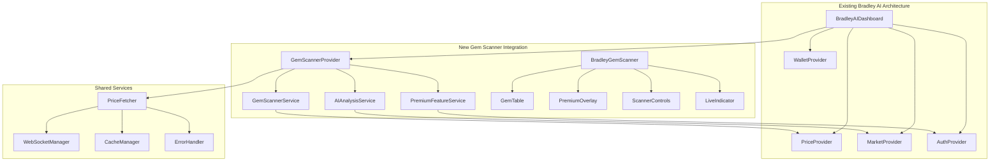
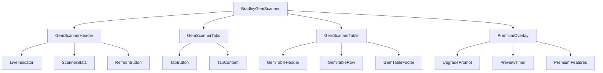

# BRADLEY GEM SCANNER INTEGRATION PLAN

## Table of Contents

1. [Executive Summary](#executive-summary)
2. [Integration Architecture](#integration-architecture)
3. [Component Integration Strategy](#component-integration-strategy)
4. [Premium Features Architecture](#premium-features-architecture)
5. [Data Flow & State Management](#data-flow--state-management)
6. [API Integration Layer](#api-integration-layer)
7. [Service Architecture](#service-architecture)
8. [UI/UX Integration](#uiux-integration)
9. [Security & Access Control](#security--access-control)
10. [Performance Optimization](#performance-optimization)
11. [Implementation Roadmap](#implementation-roadmap)
12. [Code Examples & Patterns](#code-examples--patterns)

---

## Executive Summary

**Bradley Gem Scanner** integration represents a sophisticated AI-powered cryptocurrency discovery system that seamlessly integrates with the existing Bradley AI dashboard architecture. This implementation plan ensures modular integration, premium feature management, and adherence to established code patterns.

### Key Integration Goals
- **Seamless Integration**: Leverage existing providers, services, and UI patterns
- **Premium Feature Architecture**: Implement subscription-based access control
- **Real-time Data**: Integrate with existing price providers and WebSocket infrastructure
- **AI-Powered Analysis**: Utilize existing AI service patterns for gem scoring
- **Performance Optimized**: Maintain existing performance standards and caching strategies

### Integration Scope
- **Component Integration**: 5 new components following existing patterns
- **Service Layer**: 3 new services integrated with existing architecture
- **Premium Features**: Subscription management and access control
- **API Endpoints**: 4 new endpoints following existing API patterns
- **State Management**: Zustand store integration for gem scanner state

---

## Integration Architecture



### Integration Principles

1. **Provider Pattern Consistency**: Follow existing provider architecture
2. **Service Layer Integration**: Utilize existing service patterns and error handling
3. **Component Composition**: Maintain existing component hierarchy and styling
4. **State Management**: Integrate with existing Zustand stores
5. **Premium Feature Gates**: Implement consistent access control patterns

---

## Component Integration Strategy

### Core Component Structure

```typescript
// src/components/gem-scanner/bradley-gem-scanner.tsx
interface BradleyGemScannerProps {
  className?: string
  initialTab?: 'crypto' | 'meme' | 'defi'
  premiumAccess?: boolean
}

// Integration with existing dashboard
// src/components/v0-dashboard/bradley-ai-dashboard.tsx
export function BradleyAIDashboard() {
  return (
    <div className="min-h-screen bg-black text-white relative overflow-hidden">
      <MatrixBackground />
      <div className="relative z-10 p-6">
        <BradleyAIHeader />
        <div className="grid grid-cols-1 xl:grid-cols-2 gap-6 mb-6">
          <BradleyAIStatsCards />
          <BradleyGemScanner /> {/* New Integration */}
        </div>
        <DirectPriceDisplay />
      </div>
    </div>
  )
}
```

### Component Hierarchy



---

## Premium Features Architecture

### Subscription Management Integration

```typescript
// src/lib/services/premium-service.ts
export class PremiumService {
  private static instance: PremiumService
  private subscriptionCache = new Map<string, SubscriptionStatus>()

  static getInstance(): PremiumService {
    if (!PremiumService.instance) {
      PremiumService.instance = new PremiumService()
    }
    return PremiumService.instance
  }

  async checkPremiumAccess(userId: string): Promise<boolean> {
    // Integrate with existing auth patterns
    const cached = this.subscriptionCache.get(userId)
    if (cached && Date.now() - cached.lastChecked < 300000) { // 5min cache
      return cached.isPremium
    }

    try {
      const subscription = await this.fetchSubscriptionStatus(userId)
      this.subscriptionCache.set(userId, {
        isPremium: subscription.active,
        lastChecked: Date.now(),
        tier: subscription.tier
      })
      return subscription.active
    } catch (error) {
      console.error('[PremiumService] Error checking access:', error)
      return false
    }
  }
}
```

### Feature Gate Implementation

```typescript
// src/components/gem-scanner/premium-overlay.tsx
interface PremiumOverlayProps {
  isVisible: boolean
  gemCount: number
  onUpgrade: () => void
  onPreview: () => void
}

export function PremiumOverlay({ isVisible, gemCount, onUpgrade, onPreview }: PremiumOverlayProps) {
  if (!isVisible) return null

  return (
    <motion.div
      initial={{ opacity: 0 }}
      animate={{ opacity: 1 }}
      className="absolute inset-0 bg-slate-900/80 backdrop-blur-sm rounded-lg flex flex-col items-center justify-center z-10"
    >
      <div className="text-center p-8">
        <Lock className="w-16 h-16 text-slate-400 mx-auto mb-4" />
        <h3 className="text-xl font-mono font-bold text-white mb-2">PREMIUM GEMS LOCKED</h3>
        <p className="text-slate-400 mb-6">
          Unlock {gemCount} high-potential gems with AI scores 75%+
        </p>
        <div className="space-y-3">
          <Button
            onClick={onPreview}
            variant="outline"
            className="border-cyan-500/50 text-cyan-400 hover:bg-cyan-500/10"
          >
            <Eye className="w-4 h-4 mr-2" />
            Preview Gems (5s)
          </Button>
          <Button
            onClick={onUpgrade}
            className="bg-gradient-to-r from-cyan-500 to-blue-600 hover:from-cyan-600 hover:to-blue-700 text-white font-bold"
          >
            <Star className="w-4 h-4 mr-2" />
            Upgrade to Premium
          </Button>
        </div>
      </div>
    </motion.div>
  )
}
```

---

## Data Flow & State Management

### Zustand Store Integration

```typescript
// src/lib/store/gem-scanner-store.ts
interface GemScannerState {
  // Core State
  gems: Record<string, Gem[]>
  activeTab: 'crypto' | 'meme' | 'defi'
  isScanning: boolean
  lastScanTime: number

  // Premium State
  isPremium: boolean
  showPreview: boolean
  previewTimer: NodeJS.Timeout | null

  // UI State
  gemsFound: number
  error: string | null

  // Actions
  setActiveTab: (tab: string) => void
  updateGems: (category: string, gems: Gem[]) => void
  togglePreview: () => void
  checkPremiumStatus: () => Promise<void>
  startScanning: () => void
  stopScanning: () => void
}

export const useGemScannerStore = create<GemScannerState>((set, get) => ({
  // Initial State
  gems: { crypto: [], meme: [], defi: [] },
  activeTab: 'crypto',
  isScanning: false,
  lastScanTime: 0,
  isPremium: false,
  showPreview: false,
  previewTimer: null,
  gemsFound: 0,
  error: null,

  // Actions
  setActiveTab: (tab) => set({ activeTab: tab as any }),

  updateGems: (category, gems) => set((state) => ({
    gems: { ...state.gems, [category]: gems },
    gemsFound: Object.values({ ...state.gems, [category]: gems }).flat().length,
    lastScanTime: Date.now()
  })),

  togglePreview: () => {
    const { showPreview, previewTimer } = get()

    if (showPreview && previewTimer) {
      clearTimeout(previewTimer)
      set({ showPreview: false, previewTimer: null })
    } else {
      const timer = setTimeout(() => {
        set({ showPreview: false, previewTimer: null })
      }, 5000)
      set({ showPreview: true, previewTimer: timer })
    }
  },

  checkPremiumStatus: async () => {
    try {
      const premiumService = PremiumService.getInstance()
      const isPremium = await premiumService.checkPremiumAccess('current-user')
      set({ isPremium })
    } catch (error) {
      console.error('[GemScanner] Premium check failed:', error)
      set({ error: 'Failed to check premium status' })
    }
  }
}))
```

### Provider Integration

```typescript
// src/lib/providers/gem-scanner-provider.tsx
interface GemScannerContextType {
  gems: Record<string, Gem[]>
  isScanning: boolean
  isPremium: boolean
  scanForGems: (category: string) => Promise<void>
  refreshGems: () => Promise<void>
}

export function GemScannerProvider({ children }: { children: React.ReactNode }) {
  const gemScannerService = GemScannerService.getInstance()
  const premiumService = PremiumService.getInstance()

  const [state, setState] = useState<GemScannerContextType>({
    gems: { crypto: [], meme: [], defi: [] },
    isScanning: false,
    isPremium: false,
    scanForGems: async (category) => {
      setState(prev => ({ ...prev, isScanning: true }))
      try {
        const gems = await gemScannerService.scanCategory(category)
        setState(prev => ({
          ...prev,
          gems: { ...prev.gems, [category]: gems },
          isScanning: false
        }))
      } catch (error) {
        console.error('[GemScannerProvider] Scan failed:', error)
        setState(prev => ({ ...prev, isScanning: false }))
      }
    },
    refreshGems: async () => {
      // Implement refresh logic
    }
  })

  return (
    <GemScannerContext.Provider value={state}>
      {children}
    </GemScannerContext.Provider>
  )
}
```

---

## API Integration Layer

### Service Architecture

```typescript
// src/lib/services/gem-scanner-service.ts
export class GemScannerService {
  private static instance: GemScannerService
  private priceFetcher: PriceFetcher
  private aiService: AIAnalysisService
  private cache: CacheManager

  constructor() {
    this.priceFetcher = PriceFetcher.getInstance()
    this.aiService = AIAnalysisService.getInstance()
    this.cache = CacheManager.getInstance()
  }

  static getInstance(): GemScannerService {
    if (!GemScannerService.instance) {
      GemScannerService.instance = new GemScannerService()
    }
    return GemScannerService.instance
  }

  async scanCategory(category: 'crypto' | 'meme' | 'defi'): Promise<Gem[]> {
    const cacheKey = `gems:${category}:${Date.now()}`
    const cached = await this.cache.get(cacheKey)

    if (cached) {
      return cached as Gem[]
    }

    try {
      // 1. Fetch potential tokens from multiple sources
      const tokens = await this.fetchPotentialTokens(category)

      // 2. Get real-time price data
      const priceData = await this.priceFetcher.getBulkPrices(
        tokens.map(t => t.symbol)
      )

      // 3. Run AI analysis for scoring
      const aiScores = await this.aiService.analyzeTokens(tokens, priceData)

      // 4. Combine data and filter high-potential gems
      const gems = this.combineGemData(tokens, priceData, aiScores)
        .filter(gem => gem.aiScore >= 70)
        .sort((a, b) => b.aiScore - a.aiScore)

      // 5. Cache results for 5 minutes
      await this.cache.set(cacheKey, gems, 300)

      return gems
    } catch (error) {
      console.error(`[GemScanner] Failed to scan ${category}:`, error)
      throw new Error(`Failed to scan ${category} gems`)
    }
  }

  private async fetchPotentialTokens(category: string): Promise<TokenData[]> {
    // Integrate with existing API patterns
    const response = await fetch(`/api/gem-scanner/tokens?category=${category}`)
    if (!response.ok) {
      throw new Error(`Failed to fetch ${category} tokens`)
    }
    return response.json()
  }

  private combineGemData(
    tokens: TokenData[],
    prices: PriceData[],
    aiScores: AIScore[]
  ): Gem[] {
    return tokens.map(token => {
      const price = prices.find(p => p.symbol === token.symbol)
      const aiScore = aiScores.find(s => s.symbol === token.symbol)

      return {
        name: token.name,
        symbol: token.symbol,
        price: price?.formattedPrice || '$0.00',
        change: price?.change24h || '0%',
        aiScore: aiScore?.score || 0,
        foundTime: this.formatTimeAgo(token.discoveredAt),
        status: this.determineStatus(price?.change24h || 0),
        isNew: Date.now() - token.discoveredAt < 3600000, // 1 hour
        volume: price?.formattedVolume || '$0',
        marketCap: price?.formattedMarketCap || '$0'
      }
    })
  }
}
```

### API Endpoints

```typescript
// src/app/api/gem-scanner/tokens/route.ts
export async function GET(request: Request) {
  try {
    const { searchParams } = new URL(request.url)
    const category = searchParams.get('category') || 'crypto'

    // Integrate with existing auth patterns
    const session = await getServerSession(authOptions)
    if (!session) {
      return NextResponse.json({ error: 'Unauthorized' }, { status: 401 })
    }

    const gemScannerService = GemScannerService.getInstance()
    const tokens = await gemScannerService.scanCategory(category as any)

    return NextResponse.json({ tokens, category })
  } catch (error) {
    console.error('[API] Gem scanner error:', error)
    return NextResponse.json(
      { error: 'Failed to fetch gems' },
      { status: 500 }
    )
  }
}

// src/app/api/gem-scanner/premium/route.ts
export async function GET(request: Request) {
  try {
    const session = await getServerSession(authOptions)
    if (!session?.user?.id) {
      return NextResponse.json({ error: 'Unauthorized' }, { status: 401 })
    }

    const premiumService = PremiumService.getInstance()
    const isPremium = await premiumService.checkPremiumAccess(session.user.id)

    return NextResponse.json({ isPremium })
  } catch (error) {
    console.error('[API] Premium check error:', error)
    return NextResponse.json(
      { error: 'Failed to check premium status' },
      { status: 500 }
    )
  }
}
```

---

## UI/UX Integration

### Component Implementation

```typescript
// src/components/gem-scanner/bradley-gem-scanner.tsx
'use client'

import { motion } from 'framer-motion'
import { Search, TrendingUp, Target, BarChart3, RefreshCw } from 'lucide-react'
import { useGemScannerStore } from '@/lib/store/gem-scanner-store'
import { useHydration } from '@/components/ui/hydration-safe'
import { LiveIndicator } from '@/components/ui/live-indicator'
import { PremiumOverlay } from './premium-overlay'
import { GemTable } from './gem-table'

export function BradleyGemScanner() {
  const isHydrated = useHydration()
  const {
    gems,
    activeTab,
    isScanning,
    isPremium,
    showPreview,
    gemsFound,
    setActiveTab,
    togglePreview,
    checkPremiumStatus,
    scanForGems
  } = useGemScannerStore()

  // Hydration safety
  if (!isHydrated) {
    return <GemScannerFallback />
  }

  const currentGems = gems[activeTab] || []
  const premiumGems = currentGems.filter(gem => gem.aiScore >= 75)

  const handleRefresh = async () => {
    await scanForGems(activeTab)
  }

  const handleUpgrade = () => {
    // Integrate with existing subscription flow
    window.open('/premium', '_blank')
  }

  return (
    <motion.div
      initial={{ opacity: 0, y: 20 }}
      animate={{ opacity: 1, y: 0 }}
      transition={{ duration: 0.6, delay: 0.4 }}
      className="relative overflow-hidden rounded-lg border border-cyan-500/30 bg-gradient-to-br from-black/90 via-slate-900/80 to-black/90 shadow-2xl shadow-cyan-500/20 backdrop-blur-md"
    >
      {/* Header */}
      <div className="relative flex items-center justify-between p-6 border-b border-cyan-500/20">
        <div className="flex items-center space-x-3">
          <div className="relative">
            <div className="w-8 h-8 bg-gradient-to-br from-cyan-400 to-blue-500 rounded-full flex items-center justify-center">
              <Search className="w-4 h-4 text-black" />
            </div>
            <div className="absolute inset-0 bg-cyan-400/20 rounded-full blur-sm animate-pulse"></div>
          </div>
          <div>
            <h2 className="text-xl font-mono font-bold bg-gradient-to-r from-cyan-400 to-blue-400 bg-clip-text text-transparent">
              GEM SCANNER
            </h2>
            <p className="text-xs text-slate-400">
              {isPremium ? "AI-Powered Hidden Gem Discovery" : "Premium Feature - Upgrade to Access"}
            </p>
          </div>
        </div>

        <div className="flex items-center space-x-4">
          <LiveIndicator
            isLive={!isScanning}
            isLoading={isScanning}
            onRefresh={handleRefresh}
            showRefresh={true}
          />
          <div className="flex items-center space-x-2 bg-yellow-500/20 text-yellow-400 px-3 py-1 rounded-full text-sm">
            <div className="w-2 h-2 bg-yellow-400 rounded-full animate-pulse"></div>
            <span className="font-mono">{gemsFound} GEMS</span>
          </div>
        </div>
      </div>

      {/* Tabs */}
      <div className="flex border-b border-slate-700/50">
        {['crypto', 'meme', 'defi'].map((tab) => (
          <button
            key={tab}
            onClick={() => setActiveTab(tab)}
            className={`flex-1 px-6 py-3 text-sm font-mono uppercase tracking-wider transition-colors ${
              activeTab === tab
                ? 'bg-cyan-500/20 text-cyan-400 border-b-2 border-cyan-400'
                : 'text-slate-400 hover:text-cyan-400 hover:bg-slate-800/50'
            }`}
          >
            {tab}
          </button>
        ))}
      </div>

      {/* Content */}
      <div className="relative">
        <GemTable
          gems={currentGems}
          isLoading={isScanning}
          isPremium={isPremium}
          showPreview={showPreview}
        />

        <PremiumOverlay
          isVisible={!isPremium && !showPreview && premiumGems.length > 0}
          gemCount={premiumGems.length}
          onUpgrade={handleUpgrade}
          onPreview={togglePreview}
        />
      </div>
    </motion.div>
  )
}

// SSR-safe fallback
function GemScannerFallback() {
  return (
    <div className="relative overflow-hidden rounded-lg border border-cyan-500/30 bg-gradient-to-br from-black/90 via-slate-900/80 to-black/90 shadow-2xl shadow-cyan-500/20 backdrop-blur-md">
      <div className="p-6">
        <div className="flex items-center space-x-3 mb-6">
          <div className="w-8 h-8 bg-slate-700 rounded-full animate-pulse"></div>
          <div className="space-y-2">
            <div className="h-4 bg-slate-700 rounded w-32 animate-pulse"></div>
            <div className="h-3 bg-slate-700 rounded w-48 animate-pulse"></div>
          </div>
        </div>
        <div className="space-y-4">
          {[...Array(3)].map((_, i) => (
            <div key={i} className="h-16 bg-slate-800/40 rounded animate-pulse"></div>
          ))}
        </div>
      </div>
    </div>
  )
}
```

---

## Implementation Roadmap

### Phase 1: Core Integration (Week 1-2)
1. **Service Layer Setup**
   - Create `GemScannerService` following existing patterns
   - Integrate with `PriceFetcher` and existing APIs
   - Implement caching using existing `CacheManager`

2. **State Management**
   - Create Zustand store for gem scanner state
   - Integrate with existing error handling patterns
   - Implement hydration-safe state management

3. **Basic Components**
   - Create core `BradleyGemScanner` component
   - Implement `GemTable` with existing styling patterns
   - Add to dashboard layout

### Phase 2: Premium Features (Week 3)
1. **Premium Service**
   - Implement `PremiumService` with subscription checking
   - Create premium overlay components
   - Integrate with existing auth patterns

2. **Access Control**
   - Implement feature gates and preview functionality
   - Add upgrade prompts and subscription flows
   - Test premium/free user experiences

### Phase 3: AI Integration (Week 4)
1. **AI Analysis Service**
   - Create `AIAnalysisService` for gem scoring
   - Integrate with existing AI service patterns
   - Implement token analysis algorithms

2. **Real-time Updates**
   - Integrate with existing WebSocket infrastructure
   - Implement live gem discovery
   - Add real-time scoring updates

### Phase 4: Polish & Optimization (Week 5)
1. **Performance Optimization**
   - Implement efficient caching strategies
   - Optimize component rendering
   - Add loading states and error boundaries

2. **UI/UX Refinement**
   - Polish animations and transitions
   - Improve responsive design
   - Add accessibility features

---

## Code Examples & Patterns

### Integration with Existing Dashboard

```typescript
// src/components/v0-dashboard/bradley-ai-dashboard.tsx
import { BradleyGemScanner } from '@/components/gem-scanner/bradley-gem-scanner'

export function BradleyAIDashboard() {
  return (
    <div className="min-h-screen bg-black text-white relative overflow-hidden">
      <MatrixBackground />
      <div className="relative z-10 p-6">
        <BradleyAIHeader />

        {/* Main Grid Layout */}
        <div className="grid grid-cols-1 xl:grid-cols-2 gap-6 mb-6">
          <BradleyAIStatsCards />
          <BradleyGemScanner /> {/* New Integration */}
        </div>

        <div className="grid grid-cols-1 gap-6">
          <DirectPriceDisplay />
        </div>
      </div>
    </div>
  )
}
```

### Provider Integration

```typescript
// src/app/layout.tsx
export default function RootLayout({ children }: { children: React.ReactNode }) {
  return (
    <html lang="en">
      <body className={inter.className}>
        <AuthProvider>
          <PriceProvider>
            <MarketProvider>
              <GemScannerProvider> {/* New Provider */}
                <ErrorBoundary>
                  {children}
                </ErrorBoundary>
              </GemScannerProvider>
            </MarketProvider>
          </PriceProvider>
        </AuthProvider>
      </body>
    </html>
  )
}
```

### Error Handling Integration

```typescript
// Following existing error handling patterns
try {
  const gems = await gemScannerService.scanCategory(category)
  // Success handling
} catch (error) {
  console.error('[GemScanner] Scan failed:', error)

  // Use existing error store
  const errorStore = useErrorStore()
  errorStore.addError({
    id: `gem-scan-${Date.now()}`,
    message: 'Failed to scan for gems',
    type: 'warning',
    duration: 5000
  })
}
```

This integration plan ensures the Bradley Gem Scanner seamlessly integrates with your existing architecture while maintaining code quality, performance, and user experience standards.
