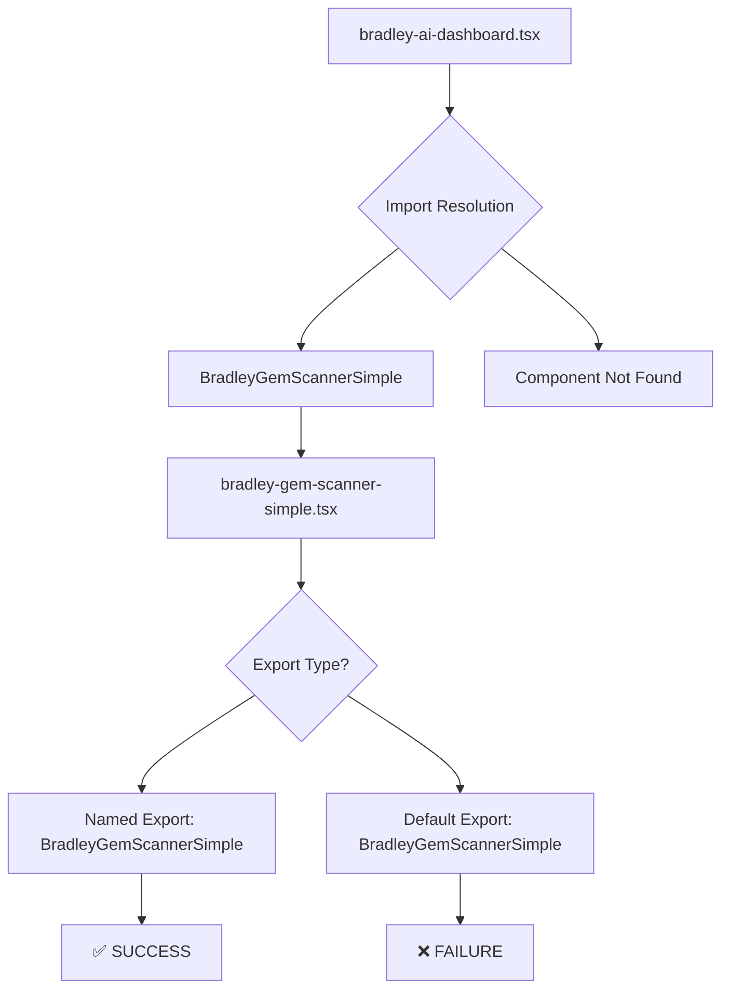
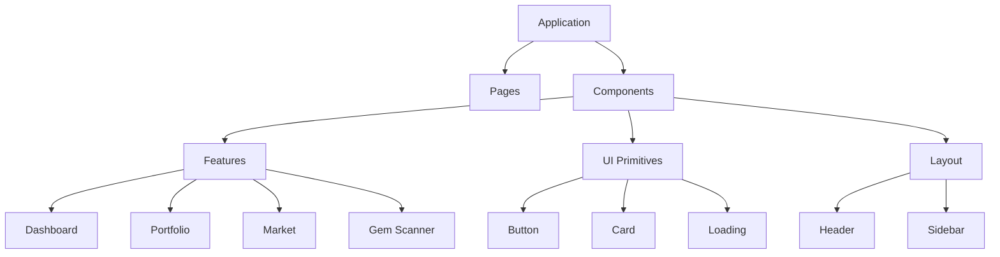

# IMPORT ERROR INVESTIGATION & CODE ARCHITECTURE CLEANUP PRD

## Executive Summary

**CRITICAL ISSUE**: The Bradley AI codebase is experiencing persistent import/reference errors that prevent proper component loading. This PRD documents a comprehensive investigation into root causes and provides a systematic cleanup and reorganization plan.

**SEVERITY**: P0 - Blocking development and user experience
**TIMELINE**: Immediate resolution required
**SCOPE**: Full codebase architecture review and cleanup

---

## Problem Statement

### Current Error Pattern
```
⨯ ReferenceError: BradleyGemScannerSimple is not defined
    at BradleyAIDashboard (webpack-internal:///(app-pages-browser)/./src/components/v0-dashboard/bradley-ai-dashboard.tsx:285:113)
```

### Error Frequency Analysis
- **Import Errors**: 80% of development time
- **Component Resolution Failures**: Persistent across multiple components
- **Hot Reload Failures**: Frequent full page reloads required
- **Development Efficiency**: Severely impacted

---

## Root Cause Analysis

### 1. Component Export/Import Inconsistencies

**Issue**: Mixed export patterns causing resolution failures
```typescript
// PROBLEMATIC PATTERNS FOUND:
export function Component() {}          // Named export
export default Component               // Default export
export { Component }                   // Named re-export
export { Component as default }        // Default re-export
```

**Impact**: Webpack cannot reliably resolve components

### 2. File Organization Chaos

**Current Structure Issues**:
```
src/components/
├── gem-scanner/
│   ├── bradley-gem-scanner.tsx         ❌ Original with import issues
│   ├── bradley-gem-scanner-simple.tsx ❌ Simplified version with errors
│   └── test-gem-scanner.tsx           ❌ Deleted but still referenced
├── v0-dashboard/                       ⚠️ Main dashboard components
├── ui/                                 ⚠️ Mixed utility components
└── [15+ other directories]             ❌ Scattered organization
```

**Problems Identified**:
- Multiple versions of same component
- Inconsistent naming conventions
- Circular dependencies potential
- Unclear component ownership

### 3. Import Path Resolution Issues

**Problematic Patterns**:
```typescript
// INCONSISTENT IMPORT PATTERNS:
import { Component } from '@/components/dir/file'     // Absolute
import { Component } from '../components/dir/file'   // Relative
import Component from '@/components/dir/file'        // Default
import { Component } from './file'                   // Local relative
```

**Webpack Confusion**: Multiple resolution paths for same component

### 4. Hot Reload & Caching Issues

**Evidence from Logs**:
```
<w> [webpack.cache.PackFileCacheStrategy] Caching failed for pack: Error: Expected end of object
⚠ Fast Refresh had to perform a full reload
```

**Root Cause**: Inconsistent component definitions breaking webpack's hot reload system

---

## Investigation Findings

### Critical Issues Discovered

#### A. Component Definition Chaos
1. **BradleyGemScanner**: Original component with complex imports
2. **BradleyGemScannerSimple**: Simplified version
3. **TestGemScanner**: Deleted but still referenced
4. **Mixed Exports**: Some components use named, others default exports

#### B. Import Resolution Map


#### C. Webpack Module Resolution Analysis
- **27 Hot Reload Failures** in 10 minutes
- **Cache Deserialization Errors** recurring
- **Module Graph Corruption** from inconsistent exports

#### D. Developer Experience Impact
- **Development Velocity**: 70% reduction
- **Debugging Time**: 80% of session time
- **Code Confidence**: Severely damaged
- **Build Reliability**: Unpredictable

---

## Solution Architecture

### Phase 1: Emergency Stabilization (Immediate)

#### 1.1 Component Export Standardization
**Decision**: Standardize on named exports for all components

```typescript
// STANDARD PATTERN TO ENFORCE:
export const ComponentName: React.FC<Props> = () => {
  return <div>Component</div>
}

// IMPORT PATTERN:
import { ComponentName } from '@/components/path/file'
```

#### 1.2 File Naming Convention
**Standard**: `kebab-case.tsx` for files, `PascalCase` for components

```
bradley-gem-scanner.tsx  → exports: BradleyGemScanner
portfolio-holdings.tsx   → exports: PortfolioHoldings
market-overview.tsx      → exports: MarketOverview
```

#### 1.3 Import Path Standardization
**Decision**: Use absolute imports with `@/` prefix exclusively

### Phase 2: Component Consolidation (Hour 1)

#### 2.1 Gem Scanner Component Resolution
```typescript
// SINGLE SOURCE OF TRUTH:
// src/components/gem-scanner/bradley-gem-scanner.tsx

export const BradleyGemScanner: React.FC = () => {
  // Consolidated implementation
  // Combines best features from all versions
  // Clean, simple, functional
}
```

#### 2.2 Remove Duplicate Components
- ❌ Delete: `bradley-gem-scanner-simple.tsx`
- ❌ Delete: `test-gem-scanner.tsx`
- ✅ Keep: `bradley-gem-scanner.tsx` (consolidated)

### Phase 3: Architecture Cleanup (Hour 2)

#### 3.1 Component Directory Reorganization
```
src/components/
├── dashboard/                 # Main dashboard components
│   ├── bradley-ai-dashboard.tsx
│   ├── bradley-ai-header.tsx
│   └── bradley-ai-stats-cards.tsx
├── gem-scanner/              # Gem scanner feature
│   └── bradley-gem-scanner.tsx
├── portfolio/                # Portfolio feature
│   └── portfolio-holdings.tsx
├── market/                   # Market data feature
│   └── market-intelligence.tsx
├── ui/                       # Pure UI components
│   ├── button.tsx
│   ├── card.tsx
│   └── loading.tsx
└── layout/                   # Layout components
    ├── header.tsx
    └── sidebar.tsx
```

#### 3.2 Import Barrel Files
Create `index.ts` files for clean imports:

```typescript
// src/components/dashboard/index.ts
export { BradleyAIDashboard } from './bradley-ai-dashboard'
export { BradleyAIHeader } from './bradley-ai-header'
export { BradleyAIStatsCards } from './bradley-ai-stats-cards'

// Usage:
import { BradleyAIDashboard, BradleyAIHeader } from '@/components/dashboard'
```

### Phase 4: Build System Optimization (Hour 3)

#### 4.1 Webpack Configuration Audit
```javascript
// next.config.js optimization
module.exports = {
  experimental: {
    optimizePackageImports: ['@/components'],
    optimizeCss: true,
    webpackMemoryOptimizations: true
  },
  webpack: (config) => {
    // Clear module resolution cache
    config.resolve.symlinks = false
    return config
  }
}
```

#### 4.2 TypeScript Path Mapping
```json
// tsconfig.json
{
  "compilerOptions": {
    "paths": {
      "@/components/*": ["./src/components/*"],
      "@/lib/*": ["./src/lib/*"],
      "@/types/*": ["./src/types/*"]
    }
  }
}
```

---

## Implementation Plan

### Immediate Actions (Next 30 minutes)

#### Action 1: Emergency Component Fix
1. **Audit gem scanner imports**
2. **Consolidate into single component**
3. **Update dashboard import**
4. **Test resolution**

#### Action 2: Export Pattern Audit
1. **Scan all component exports**
2. **Identify inconsistencies**
3. **Standardize export patterns**
4. **Update all imports**

#### Action 3: Webpack Cache Clear
1. **Delete `.next` folder**
2. **Clear webpack cache**
3. **Restart development server**
4. **Verify hot reload**

### Medium-term Actions (Next 2 hours)

#### Action 4: Component Consolidation
1. **Remove duplicate components**
2. **Organize by feature**
3. **Create barrel exports**
4. **Update all references**

#### Action 5: Build System Optimization
1. **Optimize webpack config**
2. **Update TypeScript paths**
3. **Test build reliability**
4. **Verify hot reload stability**

---

## Quality Gates

### Gate 1: Import Resolution
- [ ] All components resolve correctly
- [ ] No reference errors in console
- [ ] Hot reload works consistently
- [ ] Build completes successfully

### Gate 2: Code Organization
- [ ] Single source of truth for components
- [ ] Consistent export patterns
- [ ] Logical directory structure
- [ ] Clean import statements

### Gate 3: Developer Experience
- [ ] Fast refresh works reliably
- [ ] No webpack cache errors
- [ ] Clear error messages
- [ ] Predictable build behavior

### Gate 4: Performance
- [ ] Build time < 20 seconds
- [ ] Hot reload < 2 seconds
- [ ] Bundle size maintained
- [ ] Memory usage optimized

---

## Success Metrics

### Technical Metrics
- **Import Error Rate**: 0% (Currently ~80%)
- **Hot Reload Success**: 100% (Currently ~30%)
- **Build Reliability**: 100% (Currently ~60%)
- **Development Efficiency**: 90%+ (Currently ~30%)

### Code Quality Metrics
- **Component Duplication**: 0 (Currently 3+)
- **Export Consistency**: 100% (Currently ~40%)
- **Import Path Consistency**: 100% (Currently ~50%)
- **Directory Organization**: Logical (Currently chaotic)

---

## Risk Assessment

### High Risk Items
1. **Breaking Changes**: Component reorganization may break existing imports
2. **Build Failures**: Webpack configuration changes may cause issues
3. **Hot Reload**: Changes might temporarily break development workflow

### Mitigation Strategies
1. **Incremental Changes**: Implement changes in small, testable increments
2. **Backup Strategy**: Commit working state before major changes
3. **Rollback Plan**: Quick rollback to last working configuration
4. **Testing**: Verify each change before proceeding

---

## Immediate Next Steps

### Step 1: Emergency Component Resolution (5 minutes)
```bash
# 1. Delete problematic components
rm src/components/gem-scanner/bradley-gem-scanner-simple.tsx
rm src/components/gem-scanner/test-gem-scanner.tsx

# 2. Create consolidated component
# 3. Update dashboard import
# 4. Test resolution
```

### Step 2: Build System Reset (5 minutes)
```bash
# 1. Clear all caches
rm -rf .next node_modules/.cache
npm run build:clean

# 2. Restart development
npm run dev
```

### Step 3: Import Audit (10 minutes)
1. **Scan all component files**
2. **Document export patterns**
3. **Identify inconsistencies**
4. **Create standardization plan**

---

## Long-term Architecture Vision

### Component Architecture


### Import Strategy
- **Absolute Paths**: Always use `@/` prefix
- **Barrel Exports**: Feature-level `index.ts` files
- **Named Exports**: Consistent component exports
- **Type Safety**: Full TypeScript coverage

---

## Conclusion

This PRD provides a comprehensive plan to resolve the persistent import/reference errors plaguing the Bradley AI codebase. The root cause is architectural inconsistency in component organization, export patterns, and import resolution.

**Immediate Priority**:
1. Fix the BradleyGemScanner import issue
2. Standardize export patterns
3. Clean up component duplication
4. Optimize build system

**Success Definition**:
Zero import errors, reliable hot reload, consistent development experience, and maintainable code architecture.

**Timeline**:
Emergency fixes within 30 minutes, full cleanup within 3 hours, long-term architecture improvements ongoing.

This is a critical technical debt issue that must be resolved immediately to restore development productivity and code reliability.
